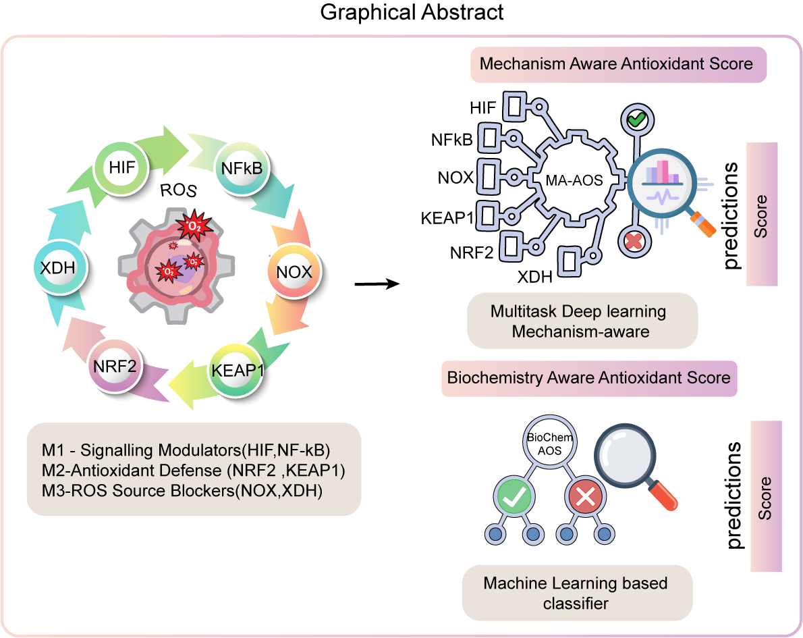

# ♞ Trojan-Horses
<br>
<div align="center">
  
</div>
<br>

<p align="center">
  
  
  
  <a href="https://github.com/the-ahuja-lab/Trojan-Horses">
    
  </a>
</p>

### *Mechanism-Aware Deep Learning for Antioxidant Activity Prediction*

**Trojan-Horses** is a *mechanism-aware computational framework* for antioxidant screening that merges **deep biological reasoning**, **chemical intelligence**, and **multitask learning** to predict antioxidant activity with high fidelity and mechanistic interpretability.

The system integrates two synergistic predictive engines:

---

## 🧬 **1. MA-AOS (Mechanism-Aware Antioxidant Scoring)**

A **Mechanism-Informed Hierarchical Multitask Learning (MI-HMTL)** deep-neural network that:

- Predicts overall antioxidant potential.
- Learns biochemical redox mechanisms.
- Estimates engagement probabilities for key oxidative-stress signaling pathways.
- Is built explicitly around **biology-informed task hierarchy**.

---

## ⚗️ **2. BioChem-AOS (Classical ML Antioxidant Classifier)**

A high-performance classical classifier that:

- Provides a global antioxidant probability score.
- Complements MA-AOS with stable classical-ML behavior.
- Enhances early-stage screening pipelines.

---

## 🧠 Shared Backbone: **ChemicalDice Molecular Embeddings**

Both models operate on **ChemicalDice embeddings**, a powerful SMILES-to-vector representation optimized for biochemical and medicinal chemistry tasks.

---

---

# ✨ **Key Features**

### 🚀 **State-of-the-Art Predictive Modeling**

- Mechanism-aware hierarchical multitask deep learning.
- Classical ensemble ML for cross-validated probability scoring.

### 🔍 **Mechanistic Interpretability**

- Pathway-level predictions for:
    - HIF
    - KEAP-1
    - NF-κB
    - NOX
    - NRF2
    - XDH
- Quantifies how each compound perturbs individual redox-biology pathways.

### 📊 **Dual Scoring System**

| Score | Description |
| --- | --- |
| **MA-AOS** | Mechanistic deep-learning antioxidant score |
| **BioChem-AOS** | Global antioxidant probability (classical ML) |

### 🧩 **ChemicalDice Integration**

- SMILES → Unified molecular vector embeddings
- No feature engineering required

---

# 📦 Installation

### Install from **TestPyPI**:

```bash
pip install -i https://test.pypi.org/simple/ TrojanHorses

```

---

# 🔑 ChemicalDice API Key

Trojan-Horses requires a ChemicalDice API key to generate molecular embeddings.

👉 **[Request ChemicalDice API Access](https://forms.gle/gPtd8Wqw4akd9Awt5)**

Enter your:

- Name
- Email
- Affiliation
- IP address

Once approved, you will receive an API key via email.

---

# 🧪 Usage

```python
from trojan_horses import trojan_horses

API_KEY = "YOUR_CHEMICALDICE_API_KEY"

smiles = [
    "CCO",
    "CCN(CC)CCO"
]

df = trojan_horses.predict(
    smiles=smiles,
    api_key=API_KEY
)

```

---

# 📊 Example Prediction Output

| SMILES | BioChem-AOS | Prediction | MA-AOS | HIF | KEAP-1 | NFkB | NOX | NRF2 | XDH |
| --- | --- | --- | --- | --- | --- | --- | --- | --- | --- |
| CCO | 0.41 | 0 | 0.38 | 0.22 | 0.14 | 0.28 | 0.40 | 0.51 | 0.31 |
| CCN(CC)CCO | 0.78 | 1 | 0.69 | 0.65 | 0.72 | 0.58 | 0.67 | 0.81 | 0.56 |

---

# 🔬 **Pathway Probability Interpretation**

Each mechanistic probability represents how strongly the compound is predicted to engage a given pathway:

| Column | Biological Meaning |
| --- | --- |
| **HIF_prob** | Hypoxia-Inducible Factor (oxygen-sensing pathway) |
| **KEAP-1_prob** | KEAP-1 modulation affecting NRF2 stabilization |
| **NFkB_prob** | Stress-response & inflammatory signaling |
| **NOX_prob** | NADPH oxidase-driven radical generation |
| **NRF2_prob** | Master antioxidant transcription factor activation |
| **XDH_prob** | Xanthine oxidase-mediated metabolic ROS generation |

➡️ **High values = stronger predicted biochemical engagement**
